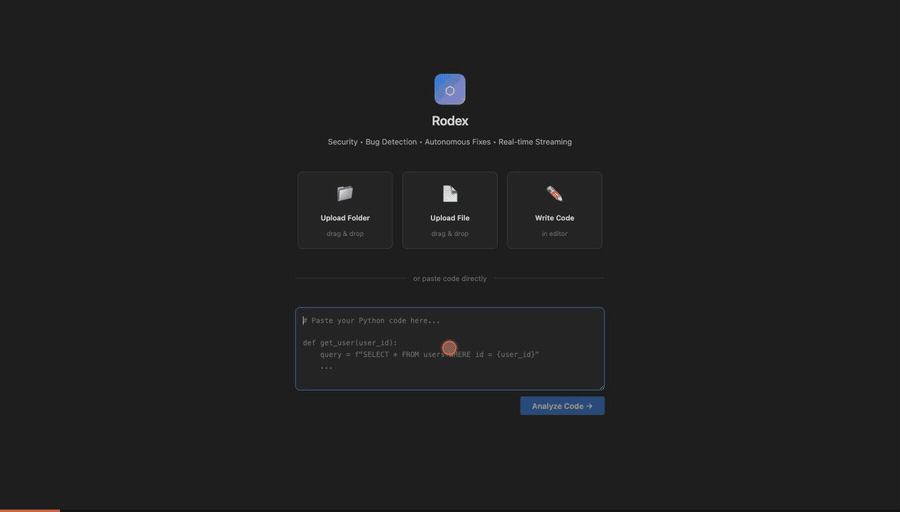

# Multi-Agent Code Review IDE

[](https://github.com/YuvrajGupta1808/Rodex-IDE/actions/workflows/ci.yml)
[](LICENSE)
[](https://www.python.org/downloads/)

A Cursor-style IDE where four AI agents perform security analysis, bug detection,
and autonomous fix application on Python code — streaming every step to the
browser over SSE. Fixes are not trusted on the model's word: each one must
compile *and* provably remove the flagged pattern before it is recorded.

Runs on **Gemini 2.5 Pro** (Vertex AI), **Gemini** (API key), or **OpenAI GPT-4o** —
the provider is one environment variable.



## Features

- **Cursor IDE UI** — Monaco editor, file tree, live agent panel, findings feed
- **4 Agents** — Coordinator, Security, Bug Detection, Fix/Patch
- **Real-time streaming** — SSE events stream all agent thoughts, tool calls, and findings live
- **Verified autonomous fixes** — every patch must compile *and* pass an AST check proving the flagged pattern is gone ([details](#fix-verification))
- **Per-agent telemetry** — tokens, reasoning tokens, latency, and USD cost per agent, in every review payload
- **Pluggable LLM provider** — Vertex AI, Gemini API, or OpenAI behind one interface
- **Blaxel sandboxes** — remote Python runtime, with a local fallback when unavailable
- **Agent Drive** — Shared POSIX filesystem mounts to all agent sandboxes simultaneously
- **MCP context tools** — Specialist agents attach tools from configurable MCP servers (filesystem, git, fetch) with per-agent allowlists, grounding reviews in richer context than raw file text

## MCP Integration

Each specialist agent can be granted tools from external [Model Context Protocol](https://modelcontextprotocol.io) servers. Declare servers in `mcp_servers.json` at the repo root (copy `mcp_servers.example.json` to start):

```json
{
  "servers": {
    "git": {
      "command": "uvx",
      "args": ["mcp-server-git", "--repository", "./"],
      "agents": ["security", "bug_detection"]
    }
  }
}
```

- `agents` restricts which specialists may use a server's tools (omit it to allow all) — e.g. give the security agent `fetch` for advisory lookups while keeping the fix agent offline
- Servers connect lazily per review session, are shared across agents, and are cleaned up when the review completes — even when the review fails
- Before analysing, each specialist gathers context from the read-only tools its servers expose (e.g. `git_status`, `git_diff_unstaged`) and prepends it to the prompt, so findings are judged against the repository's current state
- Every MCP tool call is logged like any other tool — `mcp.<server>.<tool>` with arguments, duration, and output — via a transparent proxy around the server
- A missing config file, a malformed entry, or a server that fails to start all degrade gracefully — reviews run exactly as before, with no MCP tools attached

## Security Defaults

- **CORS** is restricted to localhost dev origins; override with `RODEX_ALLOWED_ORIGINS` (comma-separated). No wildcard — a wildcard would let any website script against an API that touches the filesystem.
- **The in-IDE terminal is disabled by default** because it executes on the host. Set `RODEX_ENABLE_TERMINAL=1` to enable it for local development.
- **Uploads are capped** at 20 files / 1 MB per file.

## Quickstart

### Docker (one command)

```bash
cp .env.example .env      # add your key
docker compose up
```

Then open <http://localhost:8000>.

### Local

```bash
python -m venv .venv && source .venv/bin/activate
pip install -r requirements.txt
cp .env.example .env
uvicorn src.api.main:app --reload --port 8000
```

Upload files or paste code, click **Analyze Code**, then **Run Analysis**.

## Choosing a model

The LLM provider lives behind one factory (`src/agents/llm_client.py`); every
agent calls through it, so switching providers never touches agent code.

| `LLM_PROVIDER` | Default model | Credentials |
|---|---|---|
| `vertex` (default) | `google/gemini-2.5-pro` | `gcloud auth application-default login` + `VERTEX_PROJECT_ID` |
| `gemini` | `gemini-2.5-flash` | `GEMINI_API_KEY` from [AI Studio](https://aistudio.google.com/apikey) |
| `openai` | `gpt-4o` | `OPENAI_API_KEY` |

```bash
# Vertex AI — OAuth via application-default credentials, no API key
LLM_PROVIDER=vertex
LLM_MODEL=google/gemini-2.5-pro
VERTEX_PROJECT_ID=your-gcp-project
VERTEX_LOCATION=global
```

Set `LLM_MODEL` to override the default for any provider. Gemini 2.5 models
reason before answering; their reasoning-token counts appear in the telemetry
payload described below.

Optional keys: `BL_API_KEY` / `BL_WORKSPACE` (Blaxel sandboxes — a local
fallback is used when absent) and `MORPH_API_KEY` (fastapply edits).

## Fix verification

`py_compile` proves a patched file still parses. It does not prove the
vulnerability is gone — a fix that deletes the bug and a fix that changes
nothing both compile. Verification therefore has two gates:

1. **Compile gate** — the patched file is written into the sandbox and compiled.
2. **Pattern gate** — `src/agents/fix_verification.py` walks the AST before and
   after the patch and counts occurrences of the flagged pattern. A fix that
   does not *reduce* the count is rejected and rolled back.

Checked categories: `sql_injection`, `command_injection`,
`unsafe_deserialization`, `error_swallowing`, `resource_leak`. Categories
without a checker return "no opinion" and fall back to the compile gate, so a
missing checker never rejects a good fix.

## Telemetry

Every `review_completed` event carries per-agent usage:

```json
{
  "telemetry": {
    "agents": [
      {"agent_id": "security", "model": "google/gemini-2.5-pro",
       "calls": 1, "total_tokens": 4182, "reasoning_tokens": 512,
       "latency_ms": 8210, "cost_usd": 0.0231}
    ],
    "totals": {"total_tokens": 12043, "cost_usd": 0.0712, "wall_clock_ms": 24180}
  }
}
```

Costs use a per-model price table in `src/events/telemetry.py`; unknown models
report `0.0` rather than guessing.

## Architecture

```
┌─────────────────────────────────────────────────────────────┐
│                    COORDINATOR AGENT (gpt-4o)                │
│  Creates plan → delegates in parallel → merges findings      │
└─────┬─────────────────────┬─────────────────────┬───────────┘
      │                     │                     │
      ▼                     ▼                     ▼
┌──────────────┐  ┌──────────────┐  ┌──────────────────────┐
│ SECURITY     │  │ BUG          │  │ FIX AGENT            │
│ (gpt-4o)     │  │ DETECTION    │  │ fastapply + py_compile│
│              │  │ (gpt-4o)     │  │ + sandbox exec       │
└──────────────┘  └──────────────┘  └──────────────────────┘
       ↕ Agent Drive (shared POSIX FS — Blaxel us-was-1)
       ↕ Blaxel py-app sandbox (Python 3.11, us-pdx-1)
```

### Key Files

| Path | Purpose |
|---|---|
| `src/agents/coordinator.py` | Orchestration: plan, delegate, consolidate |
| `src/agents/security_agent.py` | SQL injection, XSS, hardcoded secrets, auth flaws |
| `src/agents/bug_agent.py` | Null refs, logic errors, race conditions, leaks |
| `src/agents/fix_agent.py` | Proposes + applies + verifies fixes |
| `src/events/bus.py` | Async fan-out event bus → SSE |
| `src/sandbox/manager.py` | Blaxel sandbox lifecycle + streaming exec |
| `src/storage/agent_drive.py` | Shared filesystem for inter-agent communication |
| `src/api/main.py` | FastAPI entrypoint |
| `src/agents/llm_client.py` | Provider factory: Vertex AI / Gemini / OpenAI |
| `src/agents/streaming.py` | Turns streamed JSON into a readable progress feed |
| `src/agents/fix_verification.py` | AST checks that a fix removed the pattern |
| `src/events/telemetry.py` | Per-agent tokens, latency, and cost |
| `ui/ide.html` + `ui/src/ide.js` | Cursor-style IDE (the app served at `/`) |

### Frontend

`ui/` is the application — a dependency-free ES-module frontend (Monaco editor,
agent panel, SSE client) served directly by FastAPI, so there is no build step.

## Testing

```bash
pip install -r requirements-dev.txt
pytest -q          # unit tests
ruff check src tests
```

CI runs both on Python 3.11 and 3.12 for every push and pull request.

## Evaluation results

Measured on the 10-file benchmark in `test_cases/buggy_samples/` (23 known
defects across 10 vulnerability classes), scored against
`test_cases/expected_findings.json`. A finding counts as a true positive when
the category matches and the line is within ±2.

**Model: Gemini 2.5 Pro (Vertex AI) · 10 files · 422s total**

| Metric | Result | Target |
|---|---|---|
| **F1** | **0.712** | ≥ 0.70 |
| Precision | 0.583 | — |
| Recall | 0.913 | — |
| **Fix verification rate** | **100%** (35/35) | ≥ 50% |
| Mean latency / file | 42.2s | — |

### Per vulnerability class

| File | Precision | Recall | F1 | Fixes verified |
|---|---|---|---|---|
| `auth_bypass.py` | 0.43 | 1.00 | 0.60 | 7/7 |
| `error_swallowing.py` | 1.00 | 1.00 | 1.00 | 3/3 |
| `hardcoded_secret.py` | 0.50 | 0.67 | 0.57 | 4/4 |
| `logic_error.py` | 1.00 | 1.00 | 1.00 | 3/3 |
| `null_reference.py` | 0.50 | 0.50 | 0.50 | 2/2 |
| `race_condition.py` | 1.00 | 1.00 | 1.00 | 1/1 |
| `resource_leak.py` | 0.40 | 1.00 | 0.57 | 4/4 |
| `sql_injection.py` | 0.50 | 1.00 | 0.67 | 4/4 |
| `type_coercion.py` | 0.67 | 1.00 | 0.80 | 3/3 |
| `xss_vulnerability.py` | 0.50 | 1.00 | 0.67 | 4/4 |

**Reading these numbers honestly:** recall is high (0.91) — the
agents find nearly every planted defect — while precision (0.58)
shows they also report extra issues beyond the fixture's list. Some are genuine
problems the fixture does not enumerate, but on this benchmark they score as
false positives, and the aggregate is the number that counts. Precision is the
clear next target.

Every proposed fix passed both verification gates (35/35),
which reflects that failed patches are rolled back rather than recorded.

Reproduce with:

```bash
python evaluate.py \
  --input test_cases/buggy_samples/ \
  --expected test_cases/expected_findings.json \
  --output docs/metrics-gemini-2.5-pro.json
```

Raw output: [`docs/metrics-gemini-2.5-pro.json`](docs/metrics-gemini-2.5-pro.json).

## Event Schema

All agent events conform to:
```json
{
  "event_type": "finding_discovered",
  "agent_id": "security",
  "timestamp": "2026-04-19T10:23:45.123Z",
  "session_id": "uuid",
  "data": { ... }
}
```

Event types: `plan_created`, `agent_delegated`, `agent_started`, `thinking`, `tool_call_start`, `tool_call_result`, `finding_discovered`, `fix_proposed`, `fix_verified`, `agent_completed`, `findings_consolidated`, `review_completed`, `error`
