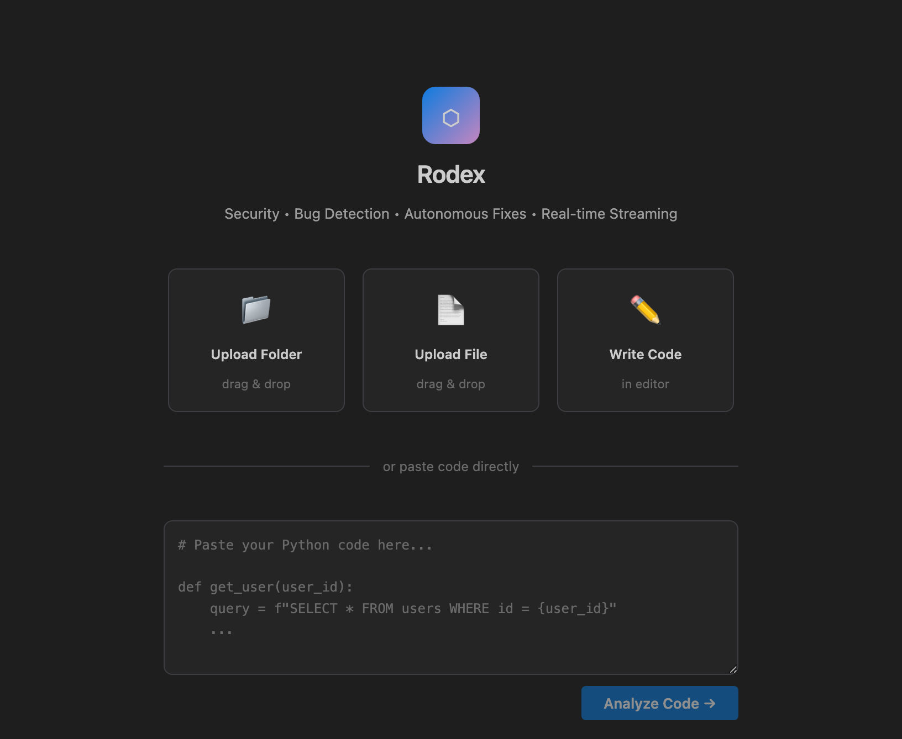
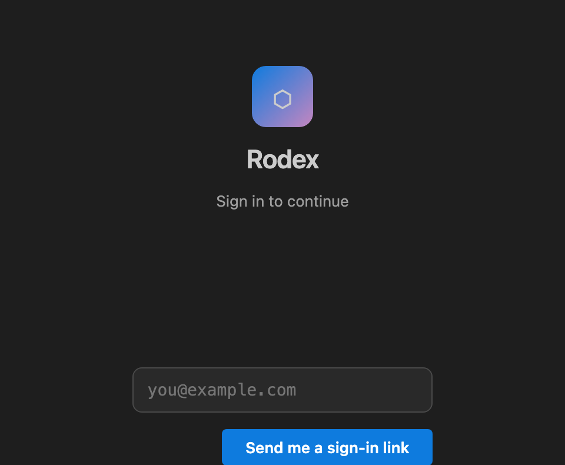
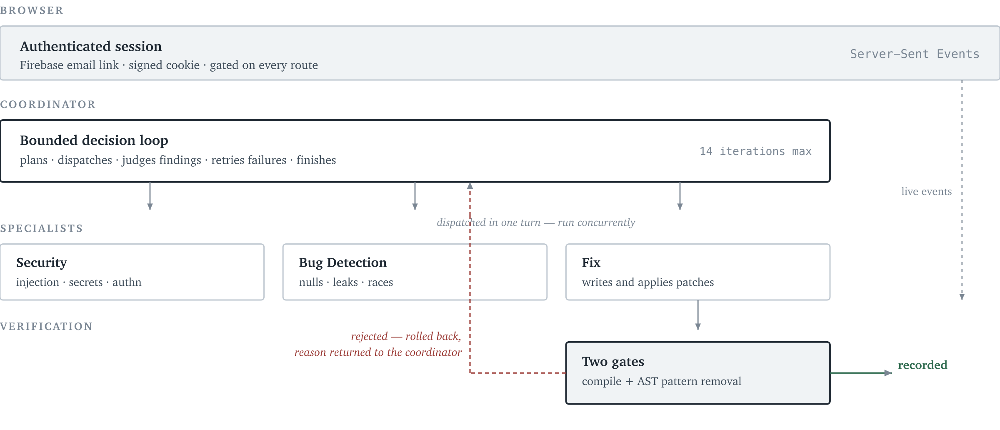
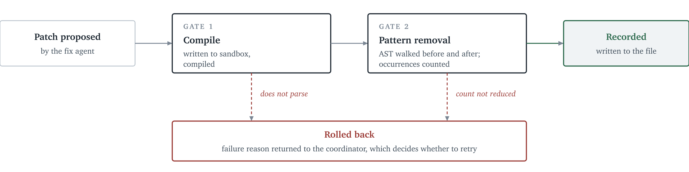

# What Rodex Does

Rodex is a deployed, authenticated web platform that reviews Python code the way a
senior engineer would: it reads the code, decides where the risk actually is,
investigates those places, writes the patches, and proves each patch works before
recording it.

A user signs in, opens or uploads a file, and presses one button. Within about two
minutes they have a reviewed and patched file, a list of what was found, and a
plain-language statement of what the system fixed and what it deliberately left alone.

Everything is visible while it happens. The interface streams each agent's reasoning,
tool calls, and findings live, so the engineer responsible for the code can see the
work rather than being handed a verdict.

{width=62%}

## Why It Is Necessary

Static analysers are fast and cheap but understand only syntax. They cannot tell a
dangerous SQL string from a safe one built the same way, so teams learn to ignore
their output.

Large language models understand intent, which makes them far better at finding real
defects — and introduces a worse problem. An LLM asked to fix a vulnerability will
produce a patch and describe it as correct whether or not it is. It is confident when
it is right and equally confident when it is wrong. Applying unverified AI patches to
a codebase is not automation; it is a new source of bugs delivered at speed.

Rodex is built on the position that a model's claim about its own work is worth
nothing. A patch is recorded only when it has passed two mechanical checks the model
does not control and cannot argue with. Fail either one and the patch is reverted and
the model is told why it failed.

That single constraint is what makes autonomous fixing safe enough to deploy, and it
is the idea the rest of the platform is built to support.

# Infrastructure

Rodex runs as a containerised service with authentication in front of every route and
isolated execution behind it. Infrastructure decisions came first because the platform
executes model-written code — an ordinary web app that gets this wrong leaks a
filesystem.

## Deployment

The whole application ships as a single Docker image and starts with one command.
Configuration is entirely environment variables, so the same image runs locally, in
staging, and in production without modification.

```bash
cp .env.example .env
docker compose up
```

Google Cloud credentials are mounted read-only at runtime rather than baked into the
image, so a published image contains no secrets.

## Authentication

Every route is gated by a session middleware. Only the login page and the health check
are public.

Sign-in uses Firebase email-link authentication: the user receives a one-time link, and
no password is stored or transmitted. The verified Firebase token is exchanged once for
a signed, timestamped session cookie that the application issues and validates itself.
Sessions expire after fourteen days. A tampered or expired cookie fails signature
verification and the request is redirected to login.

{width=44%}

## Isolation and Security Posture

The platform assumes hostile input, because it accepts arbitrary Python and runs
model-generated patches against it.

- **Sandboxed execution.** Patches are compiled and executed inside remote Blaxel
  sandboxes, not on the application host. A local fallback keeps development working
  when sandboxes are unavailable.
- **No wildcard CORS.** Allowed origins are an explicit list. A wildcard would let any
  website in a signed-in user's browser drive an API that reaches the filesystem.
- **Host terminal disabled by default.** The in-IDE terminal executes on the host, so
  it ships off and must be deliberately enabled.
- **Bounded uploads.** Twenty files, one megabyte each.
- **Shared agent filesystem.** Agents exchange files over a POSIX volume mounted into
  every sandbox, so inter-agent data never travels through prompts.

### Constraining What the Model May Run

The coordinator can run shell commands in the sandbox to inspect code, which is useful
and dangerous in equal measure. Commands are checked against an allowlist before they
execute rather than being filtered for known-bad patterns.

Only read-only inspection prefixes are permitted — `py_compile`, `grep`, `cat`, `ls`,
`head`, `tail`, `wc`. Shell metacharacters that would allow chaining, redirection, or
substitution are rejected outright: `>`, `>>`, `|`, `;`, `&&`, backticks, and `$(`, as
are `rm`, `mv`, `curl`, `wget`, `pip`, `chmod`, and `sudo`.

A rejected command returns an explanatory message to the coordinator rather than
failing silently, so the model can choose a different approach. The guard is covered by
unit tests, because an allowlist that is never tested is an allowlist that will
eventually be wrong.

## Continuous Integration

GitHub Actions runs the full test suite and the linter against Python 3.11 and 3.12 on
every push and pull request. Thirteen test modules cover the agent control loop, patch
verification, telemetry, tool integration, API guards, upload filtering, stream
keep-alive, and orchestration.

# Backend

The backend is a FastAPI application organised into agents, events, sandbox management,
storage, and API layers. Roughly 5,700 lines of Python.

## Orchestration

Four agents take part in a review. One decides; three do specialised work.

| Agent | Responsibility |
|:--|:--|
| Coordinator | Plans the review, dispatches specialists, judges findings, decides when the work is done |
| Security | Injection, hardcoded secrets, authentication flaws, unsafe deserialisation, path traversal |
| Bug Detection | Null dereferences, logic errors, resource leaks, race conditions, swallowed exceptions |
| Fix | Writes patches, applies them in the sandbox, submits them for verification |

{width=100%}

The coordinator is not a fixed pipeline. It runs as a tool-calling loop with a real
decision surface: it chooses which specialists to dispatch and what to point them at,
dismisses findings it judges to be false positives, decides which fixes are worth
attempting, and decides whether a failed patch deserves a second attempt with better
guidance.

An earlier version ran a fixed sequence — delegate, collect, fix, finish. It could not
react to what it found and had no response at all to a patch that failed verification;
it simply moved on. Replacing the script with a decision loop changed the system's
failure behaviour far more than its success behaviour.

The coordinator acts only through a fixed set of tools. Every action it can take is
one of these, which bounds the blast radius of a confused model and makes each decision
loggable:

| Tool | Effect |
|:--|:--|
| `inspect_code` | Read the file under review, with line numbers |
| `run_specialist` | Dispatch a specialist with a focus the coordinator chose |
| `dismiss_finding` | Reject a finding as a false positive, with a reason |
| `apply_fix` | Send a finding to the fix agent for patching and verification |
| `run_command` | Run a read-only inspection command in the sandbox |
| `finish_review` | Declare the review complete and emit the verdict |

The loop is bounded at fourteen iterations and three attempts per fix, so a confused
model terminates instead of spinning.

Independent specialists are dispatched in a single turn and run concurrently, as are
patches to different files. Left unguided, a model issues these one at a time and adds
a full round-trip of latency before each.

## Patch Verification

This is the core of the platform.

Compiling a patched file proves it still parses. It proves nothing about whether the
vulnerability is gone — a patch that removes the defect and a patch that changes
nothing both compile. Verification therefore has two independent gates, and a patch
must clear both.

**Gate one — compilation.** The patched file is written into the sandbox and compiled.
This rejects syntactically broken output.

**Gate two — pattern removal.** The abstract syntax tree is walked before and after the
patch and occurrences of the flagged pattern are counted. A patch that does not reduce
the count did not do its job and is rejected.

{width=100%}

The second gate is deliberately conservative. A defect category with no checker, or a
file that cannot be parsed, returns *no opinion* rather than a rejection, so a missing
checker never discards a good patch. Checkers currently exist for SQL injection,
command injection, unsafe deserialisation, error swallowing, and resource leaks.

Each checker is a deliberately narrow AST query rather than a general analysis:

| Category | What is counted |
|:--|:--|
| `sql_injection` | f-strings, concatenation, or `.format()` reaching `execute()` |
| `command_injection` | `os.system`, or `subprocess` called with `shell=True` |
| `unsafe_deserialization` | `pickle`, `yaml`, or `marshal` load calls |
| `error_swallowing` | Bare `except:` or a handler whose body is only `pass` |
| `resource_leak` | `open()` or `connect()` bound outside a `with` statement |

Narrowness is the point. A checker that tried to reason about whether a construct is
*genuinely* exploitable would be another fallible judgement layer; one that counts a
syntactic pattern either finds fewer of them after the patch or it does not.

Rejected patches are rolled back and the failure reason is returned to the coordinator,
which decides whether to retry.

## Event System

Every action an agent takes is published to an async event bus and fanned out to
connected browsers over Server-Sent Events. Thirteen event types cover planning,
delegation, reasoning, tool calls, findings, patch proposals, verification results, and
completion.

Events fall into four groups:

| Group | Events |
|:--|:--|
| Planning | `plan_created`, `step_started`, `step_completed`, `coordinator_reasoning` |
| Delegation | `agent_delegated`, `agent_started`, `agent_completed` |
| Work | `thinking`, `tool_call_start`, `tool_call_result`, `finding_discovered` |
| Outcome | `fix_proposed`, `fix_verified`, `decision_made`, `retry_scheduled`, `review_completed`, `error` |

Every event carries the same envelope — type, agent, ISO-8601 timestamp, session, and a
typed payload — validated by Pydantic models rather than assembled ad hoc. The bus
keeps a per-session replay buffer, so a browser that reconnects mid-review receives the
events it missed instead of resuming from a blank panel.

Keep-alive frames hold the connection open through slow model calls, so a long review
never appears to have stalled. Failures surface as events rather than silently ending
the stream.

## Telemetry

Per-agent token counts, latency, and cost are recorded for every model call and
attached to each completed review. Providers report usage only when a response stream
ends, which would leave the interface showing nothing for most of a two-minute review;
in-flight usage is estimated from streamed output and replaced by the provider's real
figures on completion.

A representative production review: seven findings, one dismissed as a false positive,
five verified patches applied, two minutes four seconds, under four cents.

# Frontend

The interface is a Cursor-style IDE — Monaco editor, file tree, live agent panel,
findings feed — written as dependency-free ES modules and served directly by the
backend. Roughly 3,600 lines. There is no build step, no bundler, and no JavaScript
dependency tree to audit or keep patched.

## Observability

Four panels update independently from a single event stream:

- **Agents.** Live status for each of the four agents.
- **Execution plan.** The steps the coordinator is actually taking, including failed
  patches and the retries that follow them.
- **Findings.** Severity-filtered, each linked to its line, each with a one-click fix.
- **Telemetry.** Token usage and cost, updating continuously rather than at the end.

Verified patches are marked in the editor gutter and the corrected source appears in
place.

{width=100%}

Showing failures matters as much as showing successes. When a patch fails verification
and is retried, both attempts appear in the plan. An interface that displayed only
successful steps would hide precisely the behaviour that makes the system trustworthy.

## Closing Verdict

Every review ends with a plain-language statement of what was done and what was not:

> "I fixed a critical SQL injection vulnerability, two resource leaks, and an
> error-swallowing bug. I did not fix a hardcoded API key and a path traversal
> vulnerability, as these issues require more context to address properly."

An agent that reports only its successes cannot be trusted with a codebase. Declining a
fix that needs human judgement is correct behaviour, and surfacing that refusal is what
makes the accepted fixes credible.

# Model Layer

## Provider Abstraction

Every agent reaches the model through a single factory. Provider and model are set by
environment variable, so the platform moves between Google Vertex AI, the Gemini API,
and OpenAI without touching agent code.

| Provider | Default model | Authentication |
|:--|:--|:--|
| Vertex AI | Gemini 2.5 Pro | OAuth application-default credentials |
| Gemini API | Gemini 2.5 Flash | API key |
| OpenAI | GPT-4o | API key |

Vertex is the production default. It authenticates with short-lived OAuth tokens
refreshed per client rather than a static key, so no long-lived model credential exists
in the deployment.

This matters operationally: a cheaper model can serve routine reviews while a stronger
one handles high-risk code, as a configuration change rather than a rewrite.

## Grounding Model Context

Specialists can be granted tools from external Model Context Protocol servers, with
per-agent allowlists — the security agent may reach an advisory lookup while the fix
agent stays offline.

Before analysing, each specialist gathers repository state from the read-only tools its
servers expose and prepends it to the prompt, so findings are judged against the
project as it actually stands rather than against isolated file text. Every such call
is logged with its arguments, duration, and output.

A missing configuration file, a malformed entry, or a server that fails to start all
degrade gracefully: the review proceeds exactly as before, without those tools.

## Measured Accuracy

Evaluated against a ten-file benchmark containing twenty-three known defects across ten
vulnerability classes. A finding counts as a true positive only when the category
matches and the reported line is within two lines of the defect.

| Metric | Result |
|:--|--:|
| F1 score | 0.712 |
| Recall | 0.913 |
| Precision | 0.583 |
| Patches verified | 35 of 35 |
| Mean latency per file | 42.2 s |

Per class:

| Benchmark file | Precision | Recall | F1 | Patches |
|:--|--:|--:|--:|--:|
| error_swallowing.py | 1.00 | 1.00 | 1.00 | 3 / 3 |
| logic_error.py | 1.00 | 1.00 | 1.00 | 3 / 3 |
| race_condition.py | 1.00 | 1.00 | 1.00 | 1 / 1 |
| type_coercion.py | 0.67 | 1.00 | 0.80 | 3 / 3 |
| sql_injection.py | 0.50 | 1.00 | 0.67 | 4 / 4 |
| xss_vulnerability.py | 0.50 | 1.00 | 0.67 | 4 / 4 |
| auth_bypass.py | 0.43 | 1.00 | 0.60 | 7 / 7 |
| hardcoded_secret.py | 0.50 | 0.67 | 0.57 | 4 / 4 |
| resource_leak.py | 0.40 | 1.00 | 0.57 | 4 / 4 |
| null_reference.py | 0.50 | 0.50 | 0.50 | 2 / 2 |

Recall of 0.913 means the system finds nearly every planted defect. Every patch it
proposed passed both verification gates — which reflects the design directly: patches
that fail are rolled back rather than recorded, so nothing unverified is ever written
to a file.

The benchmark is reproducible from a clean checkout:

```bash
python evaluate.py \
  --input test_cases/buggy_samples/ \
  --expected test_cases/expected_findings.json \
  --output docs/metrics-gemini-2.5-pro.json
```

# Summary

Rodex is a production-deployed, authenticated platform that performs autonomous code
review and repair with verification as a hard requirement rather than a feature.

- **Infrastructure.** Containerised deployment, Firebase-authenticated sessions on
  every route, sandboxed execution of model-written code, no secrets in the image, CI
  across two Python versions.
- **Backend.** Four coordinated agents under a bounded decision loop, two-gate patch
  verification with automatic rollback, real-time event streaming, per-agent telemetry.
- **Frontend.** Dependency-free IDE with full observability into agent reasoning, tool
  calls, findings, and failures.
- **Model layer.** Provider-agnostic access to Vertex AI, Gemini, and OpenAI; OAuth
  rather than static keys in production; grounded context via Model Context Protocol;
  0.712 F1 on a published benchmark.

The engineering position throughout is the same: an AI system that writes code must be
required to prove its work, and the proof must come from something other than the model
itself.

# Appendix: Running It

The platform runs from a clean checkout with a single command. Configuration is
entirely environment variables; no code changes are needed to switch providers or
deployment targets.

```bash
cp .env.example .env      # add a provider credential
docker compose up         # http://localhost:8000
```

Running locally without Docker:

```bash
python -m venv .venv && source .venv/bin/activate
pip install -r requirements.txt
uvicorn src.api.main:app --reload --port 8000
```

Tests and linting:

```bash
pip install -r requirements-dev.txt
pytest -q
ruff check src tests
```

## Development Timeline

First commit 19 April 2026. The initial build established the four-agent structure,
the event bus, and the sandbox integration. Subsequent work replaced the coordinator's
fixed script with the bounded decision loop, added the second verification gate and
rollback, introduced the provider abstraction and Model Context Protocol grounding, and
put Firebase authentication in front of every route.

## Repository Map

| Path | Contents |
|:--|:--|
| `src/agents/` | Coordinator, specialists, fix agent, control loop, verification |
| `src/events/` | Event schemas, async bus, emitter, telemetry |
| `src/api/` | FastAPI entry point, routes, session authentication |
| `src/sandbox/` | Sandbox lifecycle and streaming execution |
| `src/storage/` | Shared agent filesystem |
| `src/mcp_tools/` | Model Context Protocol manager and logging proxy |
| `ui/` | IDE, landing and sign-in pages, styles, ES modules |
| `tests/` | Thirteen test modules |
| `test_cases/` | Benchmark fixtures and expected findings |

## Key Environment Variables

| Variable | Purpose |
|:--|:--|
| `LLM_PROVIDER` | `vertex` (default), `gemini`, or `openai` |
| `LLM_MODEL` | Overrides the per-provider default model |
| `VERTEX_PROJECT_ID` | Google Cloud project for Vertex AI |
| `SESSION_SECRET_KEY` | Signing key for session cookies |
| `RODEX_ALLOWED_ORIGINS` | Comma-separated CORS allowlist |
| `RODEX_ENABLE_TERMINAL` | Opt-in for the host terminal, off by default |
| `BL_API_KEY` | Blaxel sandboxes; a local fallback is used when absent |
